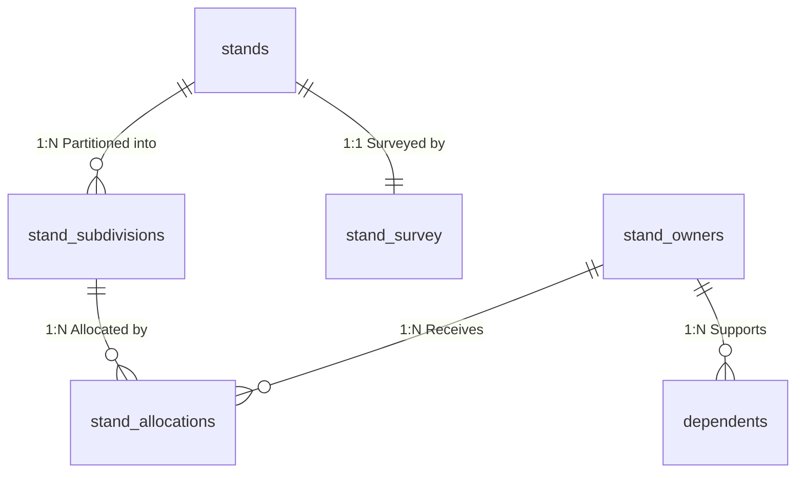

# Entity Relationship Diagram (ERD) Narrative Description

This document details the data model and structural relationship constraints for the **Land Stand Management System** (MCS 504 Database Engineering).

---

## 1. Entities & Structural Schemas

### Entity 1: `stands`
- **Purpose:** Represents the physical land stands. Holds geographical polygon footprint data.
- **Attributes:**
  - `stand_number` (VARCHAR(20)): Primary Key.
  - `location` (VARCHAR(200)): Address/description of plot location.
  - `size_m2` (DECIMAL(12,2)): Size in square metres. Must be > 0.
  - `activity` (VARCHAR(50)): Constrained to either 'Residential' or 'Commercial'.
  - `picture_url` (VARCHAR(500)): Optional physical site photo.
  - `gps_coordinates` (GEOMETRY/VARCHAR): The spatial polygon boundary (PostGIS Polygon representation).
  - `location_city` (VARCHAR(100)): City or township.

### Entity 2: `stand_survey`
- **Purpose:** Details state physical land surveys. No subdivisions are permitted until a survey is active and validated.
- **Attributes:**
  - `survey_id` (SERIAL): Primary Key.
  - `stand_number` (VARCHAR(20)): Foreign Key referencing `stands`.
  - `survey_status` (BOOLEAN): Survey verification flag (Yes/No).
  - `province` (VARCHAR(100)): Province name.
  - `district` (VARCHAR(100)): District classification.

### Entity 3: `stand_subdivisions`
- **Purpose:** Represents plots partitioned from larger parent stands.
- **Attributes:**
  - `subdivision_id` (SERIAL): Primary Key.
  - `stand_number` (VARCHAR(20)): Foreign Key referencing `stands`.
  - `allocation_status` (BOOLEAN): Status indicating whether this subdivision is currently allocated to an owner.
  - `size_m2` (DECIMAL(10,2)): Plot size. Sum of subdivision sizes must be ≤ parent stand size.
  - `remarks` (TEXT): Status remarks.

### Entity 4: `stand_owners`
- **Purpose:** Registered land stand owners. Holds sensitive personal information (PII).
- **Attributes:**
  - `stand_owner_id` (SERIAL): Primary Key.
  - `firstname` (VARCHAR(100)): PII First name.
  - `date_of_birth` (DATE): PII birth date for age verification.
  - `gender` (VARCHAR(10)): PII gender specification ('Male', 'Female', 'Other').
  - `disability_status` (BOOLEAN): Priority assist flag. True triggers priority scoring for queues.
  - `province` (VARCHAR(100)): Primary residential province.
  - `district` (VARCHAR(100)): Primary residential district.

### Entity 5: `dependents`
- **Purpose:** Registered family dependants. Inherits geographic reporting dimensions from the parent owner.
- **Attributes:**
  - `dependent_id` (SERIAL): Primary Key.
  - `stand_owner_id` (INT): Foreign Key referencing `stand_owners`.
  - `firstname` (VARCHAR(100)): Dependent name.
  - `date_of_birth` (DATE): Dependent birth date.
  - `gender` (VARCHAR(10)): Dependent gender.
  - `disability_status` (BOOLEAN): Dependent disability status.

### Entity 6: `stand_allocations`
- **Purpose:** Resolves the Many-to-Many relationship between `stand_owners` and `stand_subdivisions`.
- **Attributes:**
  - `allocation_id` (SERIAL): Primary Key.
  - `stand_owner_id` (INT): Foreign Key referencing `stand_owners`.
  - `subdivision_id` (INT): Foreign Key referencing `stand_subdivisions`.
  - `date_of_allocation` (DATE): Assignment date.
  - `price_per_m2` (DECIMAL(10,2)): Sales cost per square metre. Must be > 0.

---

## 2. Logical Relationship Narrative

1. **Stands & Surveys (1:1 Relationship):**
   A physical stand is surveyed. The `stand_survey` references `stands` via `stand_number`. We enforce a strict business constraint that a survey record with `survey_status = TRUE` must exist before any subdivisions can be registered on a parent stand.

2. **Stands & Subdivisions (1:Many Relationship):**
   A parent surveyed stand can be partitioned into one or many `stand_subdivisions`. The ORM maps this via a Foreign Key on `stand_number`. We apply a strict constraint that the total sum of partitioned subdivision sizes cannot exceed the parent stand's footprint size (`size_m2`).

3. **Owners & Dependents (1:Many Relationship):**
   An owner (`stand_owners`) can register multiple `dependents` (spouses, children). Dependents inherit geographic indicators (province and district) dynamically from their parent owner for reporting purposes.

4. **Many-to-Many resolved by Stand Allocations (Owners <-> Subdivisions):**
   An owner can acquire multiple subdivisions across different stands, but a single subdivision can only be assigned to **one owner** at a time. This M:M relation is resolved cleanly via the `stand_allocations` bridge table, ensuring proper transactional governance and auditing.
